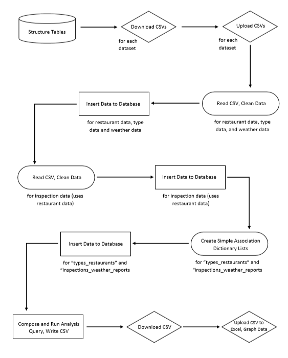
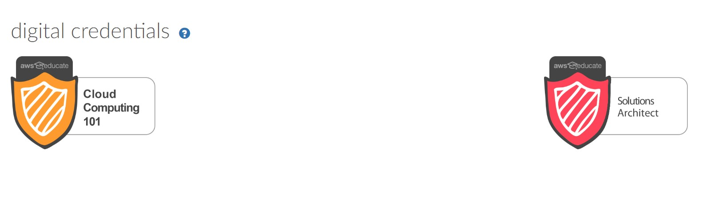

## Portfolio

---

[Automating the Verification of Historically Underutilized Business (HUB) Status of Vendors for the Texas Department of Information Resources](/capstone)

---
[Analysis of Austin, TX Restaurant Inspection Scores and Weather](https://github.com/mcslovenski/wrangling-project)

---
[Technology Learning Blog](https://github.com/mcslovenski/learning-blog)

---

## Other Links

- [About Me](/about)
- [Resume](pdf/mike-slovenski.pdf)
- [Technology Learning Blog](https://github.com/mcslovenski/learning-blog)

---

---

Page template forked from <a href="https://github.com/evanca/quick-portfolio">evanca</a>

<!-- Remove above link if you don't want to attibute -->
