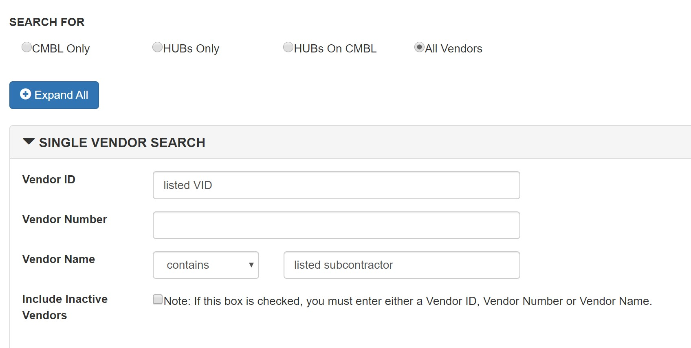

## Portfolio

---

[Automating the Verification of Historically Underutilized Business (HUB) Status of Vendors for the Texas Department of Information Resources](https://github.com/mcslovenski/HUB-Status-Verification)
This project automates the process by which HUB status is verified by employees of the DIR. It is necessary to verify the HUB status of vendors when they are listed as subcontractors on subcontracting plans. This project was primarily a challenge of information management, requiring document parsing, browser automation and html parsing, and logging.

---
[Analysis of Austin, TX Restaurant Inspection Scores and Weather](https://github.com/mcslovenski/wrangling-project)
This project was an exploration of correlation between restaurant inspection score and the weather on the day of corresponding inspections. My sources contained data on food inspection score and date, restaurant name and types, and data for many different aspects of weather including wind speeds, temperature, precipitation, and date. In completing this project I exercised data modeling techniques, data analysis techniques in Excel, and using Python, data cleansing and database ingestion techniques.

---
[Technology Learning Blog](https://github.com/mcslovenski/learning-blog)
This project was a semester-long blog of my experiences learning specific modern technologies in a self-directed studio setting. The blog is divided into three "project" sections with each blog section corresponding to a 4-week period spent focused on a single technology or technology ecosystem. The three technologies I gained experience in were Amazon Web Services products, Apache Hadoop, and the Django framework for Python.

---
[Flask Planets API](https://github.com/mcslovenski/planets-api)
This project was a personal practice exercise that I undertook based on the LinkedIn Learning course "Building RESTful APIs with Flask" by Bruce Van Horn. This project leveraged the Flask framework most significantly as well as the ORM SQL Alchemy, and testing with Postman.

---

## Other Links

- [About Me](/about)
- [Resume](pdf/mike-slovenski.pdf)
- [LinkedIn](https://linkedin.com/in/mike-slovenski)

---

---

Page template forked from <a href="https://github.com/evanca/quick-portfolio">evanca</a>

<!-- Remove above link if you don't want to attibute -->
